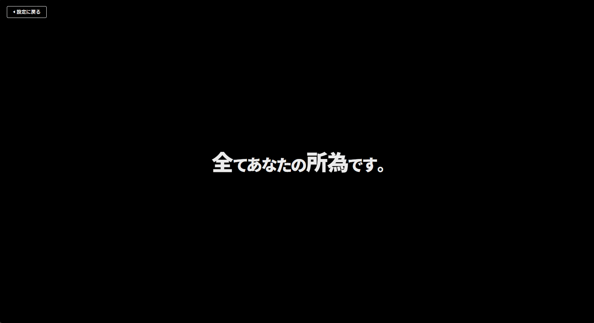
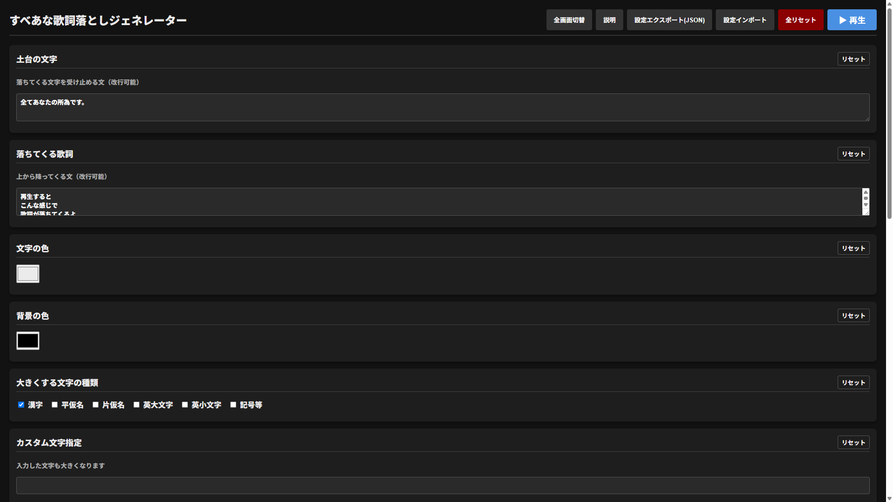

# sban-kashiotoshi-generator
「すべあな歌詞落としジェネレーター」\
このツールは、[全てあなたの所為です。](https://www.youtube.com/@subeteanatanoseidesu)氏の楽曲、[..](https://www.youtube.com/watch?v=7CUpc5K1li4)のPVに登場する物理演算演出を、ブラウザ上で再現することを目的としたものです。すべあな模倣などに使えるかもしれません。\
**[👉 オンラインで使う（GitHub Pagesが開きます）](https://priusup.github.io/sban-kashiotoshi-generator/)**

## 🖼️ スクリーンショット
\

## ✨ 主な機能
- 見た目や物理演算の設定を細かく指定可能。
  

    
設定項目一覧（クリックして開きます）

    <ul>
      <li>土台の文字（本家でいう「全てあなたの所為です。」に該当する部分）</li>
      <li>落ちてくる歌詞</li>
      <li>文字の色</li>
      <li>背景の色</li>
      <li>大きくする文字の種類（漢字、平仮名、片仮名、英大文字、英小文字、記号等から複数選択可能）</li>
      <li>カスタム文字指定（入力欄に入力した文字だけ個別で指定できます）</li>
      <li>それ以外の文字の小ささ (%)</li>
      <li>全体の基準サイズ (px)</li>
      <li>物理: 反発係数 (0〜1)</li>
      <li>物理: 摩擦係数 (0〜1)</li>
      <li>物理: 重力スケール</li>
      <li>フォント選択（デフォルトorカスタムフォント。デフォルトの場合はGoogle FontsからNoto Sans JP Blackが使用され、カスタムの場合はPC内のフォントを選ぶことができます）</li>
    </ul>
  

- 設定はブラウザのローカルストレージに自動保存。
- 設定をJSONファイルとして保存・読み込み可能。
- Matter.jsを使用した物理演算。
- 全画面表示に対応。

## 🚀 使い方
1. ツールを開きます。
1. 設定を編集します。
1. 必要に応じて全画面表示に切り替えます。
1. 必要に応じて、ブラウザやOSの画面録画機能などを利用して録画を開始してください。\
※ツール自体には画面録画機能は内蔵されていません。
1. 上部の再生ボタンをクリックすると、物理演算アニメーションが再生されます。

## 💻 ローカルで実行する
このツールはビルドや依存関係のインストールを必要としません。
1. このリポジトリをダウンロード、またはクローンします。
2. `index.html` をブラウザで開きます。

※Matter.jsやNoto Sans JPを読み込むため、インターネット接続が必要です。

## 💾 設定の保存について
設定はブラウザのローカルストレージに自動保存されます。\
また、設定をJSONファイルとしてエクスポート・インポートすることもできます。\
※ローカルストレージに保存された設定は、別のブラウザや端末には自動的に同期されません。

## 🌐 動作環境
以下のようなモダンブラウザでの動作を想定しています。
- Google Chrome
- Microsoft Edge
- Mozilla Firefox

JavaScriptが有効になっている必要があります。\
また、デフォルトフォントとしてGoogle FontsからNoto Sans JPを読み込むため、フォントの読み込みにはインターネット接続が必要です。

## 🛠️ 使用技術
- HTML
- CSS
- JavaScript
- Matter.js 0.19.0
- Google Fonts / Noto Sans JP

## ⚠️ 注意事項
- 本ツールはブラウザ上で動作します。
- 大量の文字を使用した場合など、環境によっては動作が重くなる場合があります。
- カスタムフォントを使用する場合、そのフォントが利用するPCにインストールされている必要があります。
- ブラウザやOSなどの環境によって、文字の表示や物理演算の結果が異なる場合があります。
- 画面録画機能は内蔵されていません。

## 📜 ライセンス・権利について
### 本ツールのコード
本ツールの自作コードは **MIT License** の下で公開しています。\
詳しくは、リポジトリ内の [`LICENSE`](./LICENSE) をご覧ください。

### 第三者ライブラリ・フォント
本ツールでは、以下の第三者ライブラリ・フォントを使用しています。

#### Matter.js
物理演算エンジンとして **Matter.js 0.19.0** を使用しています。
- ライセンス: MIT License
- Copyright: Liam Brummitt and contributors
- [Matter.js](https://github.com/liabru/matter-js)

Matter.jsのライセンスは、Matter.jsのライセンス条項に従います。

#### Noto Sans JP
デフォルトフォントとして **Noto Sans JP** をGoogle Fontsから読み込んでいます。
- ライセンス: SIL Open Font License 1.1
- [Noto Sans JP - Google Fonts](https://fonts.google.com/specimen/Noto+Sans+JP)

### 元作品について
本ツールは、**「全てあなたの所為です。」氏の楽曲「..」のPVに登場する演出を再現することを目的とした、非公式の二次創作ファンツールです。**\
楽曲・PV・キャラクター・名称・その他の元作品に関する権利は、それぞれの権利者に帰属します。\
本ツールは原作者・権利者による公式作品ではなく、原作者・権利者からの公式な関係・承認・提携等を示すものではありません。

## 🤖 開発について
このツールは、AI（Gemini、ChatGPT等）を活用して制作しました。

## 🐛 既知の問題
現在確認されている重大な既知の問題はありません。\
問題を発見した場合は、GitHub Issuesなどで報告していただけると助かります。